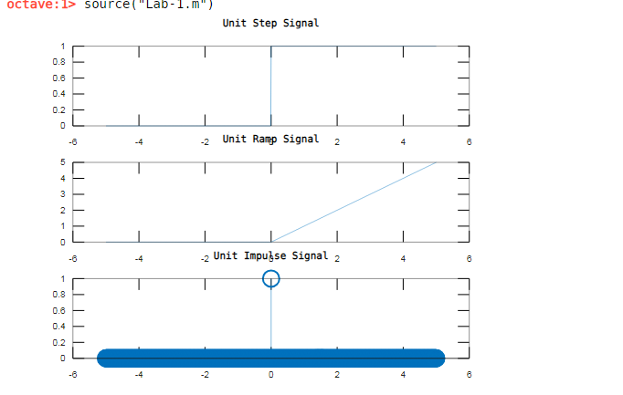
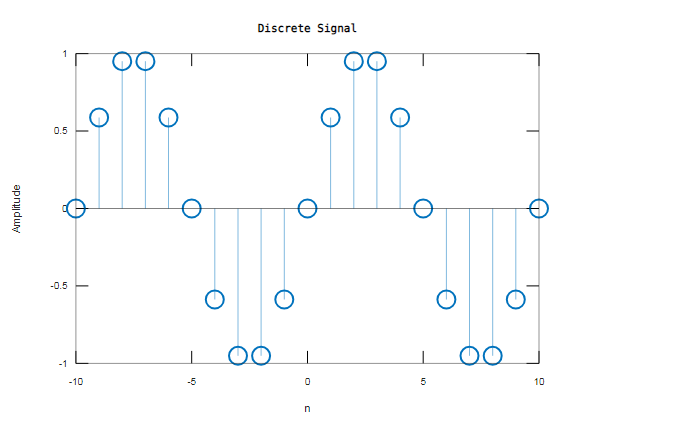
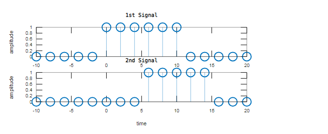
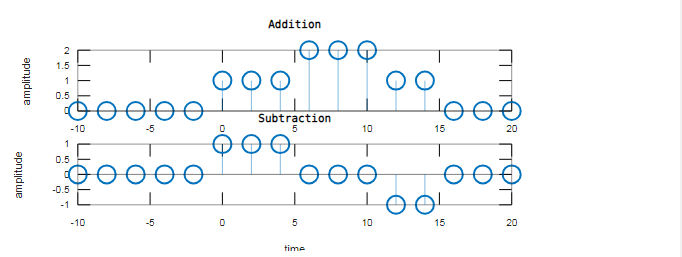
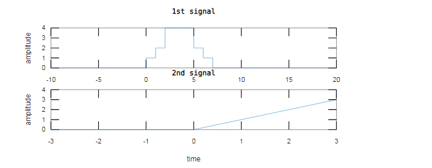

<!-- <script type="text/javascript" src="http://cdn.mathjax.org/mathjax/latest/MathJax.js?config=TeX-AMS-MML_HTMLorMML"></script>
<script type="text/x-mathjax-config"> MathJax.Hub.Config({ tex2jax: {inlineMath: [['$', '$']]}, messageStyle: "none" });</script> -->
<div style="text-align: justify">

**Experiment No:** 01

**Experiment Date:** 20 - 03 - 2023

**Experiment Name:** 

1. Plotting unit step, unit ramp, unit impulse signal using MATLAB.
2. Plotting discrete signal using MATLAB.
3. Plotting two different discrete signal and show their addition and subtraction using MATLAB.
4. Plotting two different continuous signal using MATALB.

**Theory:**

Signals are representations of varying physical quantities that convey information. They can be categorized as continuous or discrete, and their shapes can be described using mathematical functions.

- ***Unit Step Signal:*** The unit step signal, also known as the Heaviside step function, is a signal that starts from zero and then jumps to one at t = 0.
- ***Unit Ramp Signal:*** The unit ramp signal is a linearly increasing signal that starts from zero at t = 0.
- ***Unit Impulse Signal:*** The unit impulse signal, also known as the Dirac delta function, is a signal that is zero everywhere except at t = 0, where it is infinite.
- ***Continuous Signal:*** A continuous signal or a continuous-time signal is a varying quantity whose domain, which is often time, is a continuum. That is, the function's domain is an uncountable set. The function itself need not to be continuous.

\
**1. Code for plotting Unit Step, Unit Ramp and Unit Impulse Signal:**
```m
% Time vector
t = -5:0.01:5;

% Unit Step Signal
unit_step = (t >= 0);

% Unit Ramp Signal
unit_ramp = t .* unit_step;

% Unit Impulse Signal
unit_impulse = (t == 0);

% Plotting
subplot(3,1,1);
plot(t, unit_step);
title('Unit Step Signal');

subplot(3,1,2);
plot(t, unit_ramp);
title('Unit Ramp Signal');

subplot(3,1,3);
stem(t, unit_impulse);
title('Unit Impulse Signal');
```

**Output 1:**



<center> Fig. 1: Output of Unit Step, Ramp and Impulse Signal. </center>

\
**2. Code for plotting discrete signal**
```m
% Discrete time indices
clc
n = -10:10;

discrete_signal = sin(0.2 * pi * n);

% Plotting
stem(n, discrete_signal);
title('Discrete Signal');
xlabel('n');
ylabel('Amplitude');

```

**Output 2:**



<center> Fig. 2: Output of Discrete Time Signal </center>

\
**3. Code for plotting two different discrete signal and show their addition and subtraction:**
```m
clc

t = -10:2:20;
% Signal 1
n1 = t>=0 & t<=10;

%Plotting Signal 1
subplot(4,1,1);
stem(t,n1);
xlabel('time'); 
ylabel('amplitude');
title('1st Signal');

%Signal 2
n2 = t>=5 & t<=15;

%Plotting Signal 2
subplot(4,1,2);
stem(t,n2);
xlabel('time');
ylabel('amplitude');
title('2nd Signal');

%Addition and Plotting
add = n1+n2;
subplot(4,1,3);
stem(t,add);
xlabel('time');
ylabel('amplitude');
title('Addition');

%Subtraction and Plotting
sub = n1-n2;
subplot(4,1,4);
stem(t,sub);
xlabel('time');
ylabel('amplitude');
title('Subtraction');
```

**Output 3:**




<center> Fig. 3: Output of two signals and their addition and subtraction. </center>

**4. Code for plotting two different continuous signal:**
```m
clc
clear all

t = -10 : 0.01 : 20;
n1 = t >= 0 & t <= 7;
n2 = t >= 1 & t <= 6;
n3 = t >= 2 & t <= 5;
s1 = n1 + n2 + 2 * n3;
subplot(2, 1, 1);
plot(t, s1);
xlabel('time');
ylabel('amplitude');
title('1st signal');

t1 = -3 : 0.01 : 3 ;
impulse = t1 >= 0;
n11 = t1.*impulse;
n22 = t1 >= 3 & t1 <= 5;
s2 = n11 + n22;
subplot(2, 1, 2);
plot(t1, s2);
xlabel('time');
ylabel('amplitude');
title('2nd signal');
```
**Output 4:**



<center> Fig. 3: Output of two different continuous signal </center>

\
**Discussion:**

 The graphs produced effectively represent the properties of various signals. The unit step, unit ramp, and unit impulse signals each have distinct features. Discrete signal plots demonstrate the sampling nature of signals in discrete systems, whereas discrete signal addition and subtraction demonstrate basic arithmetic operations in this context. 
 
 
\
**Conclusion:**

This lab taught a thorough understanding of signal types and their plotting with MATLAB. The practical experience of creating and manipulating signals improves our understanding of signal-processing ideas, laying a solid foundation.


</div>