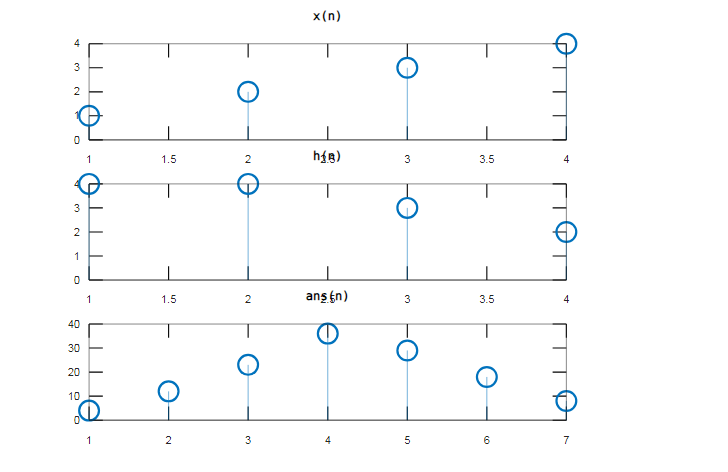

<!-- <script type="text/javascript" src="http://cdn.mathjax.org/mathjax/latest/MathJax.js?config=TeX-AMS-MML_HTMLorMML"></script>
<script type="text/x-mathjax-config"> MathJax.Hub.Config({ tex2jax: {inlineMath: [['$', '$']]}, messageStyle: "none" });</script> -->

<div style="text-align: justify">

**Experiment No:** 02

**Experiment Date:** 30. 04. 2023

**Experiment Name:** Study of Linear Convolution.

**Theory:** Linear convolution is a mathematical operation that takes two discrete functions and produces a third function that represents the combination of the two input functions. In signal processing, linear convolution is often used to convolve two signals, which involves multiplying each sample of one signal with each sample of the other signal, and summing up the results to produce a new signal. The resulting output signal will have a length equal to the sum of the lengths of the input signals minus one, since the convolution operation involves overlapping samples at the edges of the input signals. Linear convolution is a fundamental operation in signal processing and is used in many applications, such as image processing, audio processing, and digital filtering.

**Required software:** MATLAB

**Code:**
```m
clear all; 
clc;
x = [1 2 3 4]; 
h = [4 4 3 2]; 

for i = 1:length(x) 
    for j = 1 : length(h) 
        table(i, j) = x(i) * h(j); 
    end 
end 

cnt = 1; 

for i = 1 : length(h) 
    col = i; 
    row = 1; 
    res = 0; 
    while(col > 0) 
        res = res + table(row, col);
        row = row + 1; 
        col = col - 1; 
    end 
    ans(cnt) = res; 
    cnt = cnt + 1; 
end

for i = 2 : length(x) 
    row = i; 
    col = length(h); 
    res = 0; 
    while(row <= length(x)) 
        if(col < 1) break; 
        end 
    res = res + table(row, col); 
    row = row + 1; 
    col = col - 1; 
    end 

ans(cnt) = res; 
cnt = cnt + 1; 
end

subplot(3, 1, 1) 
stem(x) 
title('x(n)') 

subplot(3, 1, 2) 
stem(h) 
title('h(n)') 

subplot(3, 1, 3) 
stem(ans) 
title('ans(n)')
```

**Output :**



<center> Fig. 1: Output of Linear Convolution </center>


\
**Discussion:** In this experiment, linear convolution was implemented in MATLAB. It was done without the aid of the convolution function in MATLAB successfully.

\
**Conclusion:** In the experiment, algorithms produced exact output graphs that matched the functions and theoretical arguments presented.

</div>