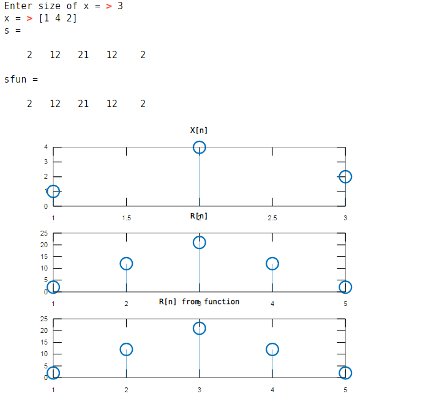
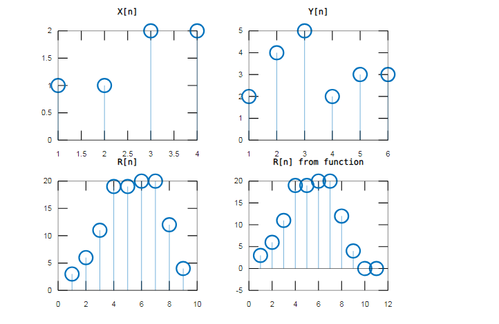

<!-- <script type="text/javascript" src="http://cdn.mathjax.org/mathjax/latest/MathJax.js?config=TeX-AMS-MML_HTMLorMML"></script>
<script type="text/x-mathjax-config"> MathJax.Hub.Config({ tex2jax: {inlineMath: [['$', '$']]}, messageStyle: "none" });</script> -->

**Experiment No:** 04

**Experiment Name:** Study of - 

1. Auto Correlation
2. Cross Correlation

<div style="text-align: justify">

**Theory:**
 
**Auto Correlation:** Auto-correlation is a statistical measure that quantifies the similarity between a signal and a time-shifted version of itself. It reveals patterns and periodicities within the signal by calculating the correlation coefficient at various time lags. Positive values indicate similarity, while negative values suggest dissimilarity. Auto-correlation is widely used in signal processing, time series analysis, and pattern recognition to understand inherent structures and repetitions within data.

**Cross Correlation:** Cross correlation is a measure of similarity of two waveforms as a function of a time-lag applied to one of them. This is also known as a sliding dot product or sliding inner-product. It is commonly used for searching a long signal for a shorter, known feature. It has applications in pattern recognition, single particle analysis, electron tomography, averaging, cryptanalysis, and neurophysiology.
</div>

\
**Code of Auto Correlation:**
```m
size = input('Enter size of x = ');
x = input('x = ');
y = x;
s = zeros(1, size * 2 - 1);
p = 1;
for k = size:-1:1
   for i = k:size
      s(p) = s(p) + y(i) * x(i - k + 1); 
   end
   p = p + 1;
end

for k = 2:size
   for i = k:size
       s(p) = s(p) + x(i) * y(i - k + 1);
   end
   p = p + 1;
end

s
sfun = xcorr(x)
subplot(3, 1, 1); stem(x); title('X[n]');
subplot(3, 1, 2); stem(s); title('R[n]');
subplot(3, 1, 3); stem(sfun); title('R[n] from function');
```

<div class="page"/>

**Input:**
```
size of x = 3
x = [1 4 2]
```

**Output of Auto Correlation:**



<center> Fig. 1: Output of auto correlation of a signal. </center>
<!-- 
<div class="page"/> -->

\
**Code of Cross Correlation:**
```m
clc
clear all
close all
size = input('size of x = ');
x = input('x = ');
size2 = input('size of y = ');
y = input('y = ');
r = zeros(1, size + size2 - 1);
p = 1;
for k = size2:-1:1
   for i = k:size2
       if i - k + 1 > size
           break
       end
      r(p) = r(p) + y(i) * x(i - k + 1); 
   end
   p = p + 1;
end

for k = 2:size
   for i = k:size
        if i - k + 1 > size2
           break
       end
       r(p) = r(p) + x(i) * y(i - k + 1);
   end
   p = p + 1;
end

r
rfun = xcorr(x, y)
subplot(2, 2, 1); stem(x); title('X[n]');
subplot(2, 2, 2); stem(y); title('Y[n]');
subplot(2, 2, 3); stem(r); title('R[n]');
subplot(2, 2, 4); stem(rfun); title('R[n] from function');
```

<!-- <div class="page"/> -->

**Input:**
```
size of x = 4
x = [1 1 2 2]
size of y = 6
y = [2 4 5 2 3 3]
```

**Output of Cross Correlation:**



<center> Fig. 2: Output of cross correlation of two signals. </center>

\
**Discussion:**
<div style="text-align: justify">
In this experiment, we have studied about auto correlation and cross correlation. We have implemented the algorithm of auto correlation and cross correlation in MATLAB. We have plotted the input signals and the output signals. We have seen that the output of auto correlation is symmetric and the output of cross correlation is not symmetric. We have also seen that the output of auto correlation and cross correlation from our algorithm and the inbuilt function of MATLAB are same.

</div>