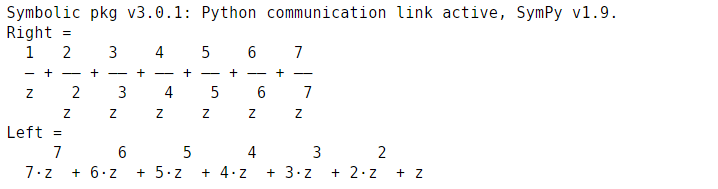

<!-- <script type="text/javascript" src="http://cdn.mathjax.org/mathjax/latest/MathJax.js?config=TeX-AMS-MML_HTMLorMML"></script>
<script type="text/x-mathjax-config"> MathJax.Hub.Config({ tex2jax: {inlineMath: [['$', '$']]}, messageStyle: "none" });</script> -->
<div style="text-align: justify">

**Experiment No:** 06

**Experiment Name:** Write a code for calculating z-transform of a signal considering left and
right sided by using MATLAB.

**Theory:**


The Z-transform is a mathematical tool used in signal processing and control systems to analyze and transform discrete-time signals from the time domain to the complex frequency domain. It converts sequences of data into functions of a complex variable 'z,' facilitating the analysis of signal properties like frequency response, stability, and system behavior. The Z-transform allows for the representation of signals in a form suitable for algebraic manipulation, enabling the design and analysis of digital filters, control systems, and other discrete-time systems. It plays a crucial role in understanding and designing systems that process discrete data in various engineering applications.

**Code:**
```m
clc
clear all
close all
x = [1 2 3 4 5 6 7];
l = length(x);
y = sym('z');
zt_l = 0;
zt_r = 0;
for i=1:l
    zt_l = zt_l+x(i)*y^(-i);
end
for i=1:l
    zt_r = zt_r+x(i)*y^(i);
end
disp('Right = ')
disp(zt_l)
disp('Left = ')
disp(zt_r)

```

<!-- <div class="page"/> -->

**Output:**



<center> Fig. 1: Output </center>

<!-- <div class="page"/> -->

\
**Discussion:** A signal's left and right-sided Z-transform implementation involves signal length calculation using 'length,' followed by separate for loops for left and right-sided conditions, culminating in an output display. It was successfully done using MATLAB.

</div>
