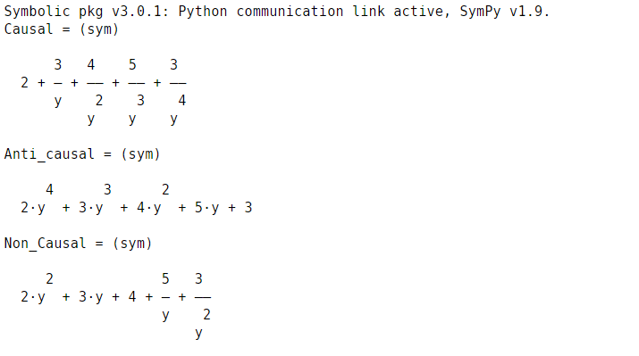

<!-- <script type="text/javascript" src="http://cdn.mathjax.org/mathjax/latest/MathJax.js?config=TeX-AMS-MML_HTMLorMML"></script>
<script type="text/x-mathjax-config"> MathJax.Hub.Config({ tex2jax: {inlineMath: [['$', '$']]}, messageStyle: "none" });</script> -->
<div style="text-align: justify">

**Experiment No:** 05

**Experiment Name:** Study of Causal, Non-causal and Anti causal Signals.

**Theory:**


A signal is said to be causal if it is zero for negative time. 

A signal is said to be non-causal if it is non-zero for negative time. 

A signal is said to be anti-causal if it is zero for positive time.


**Code:**
```matlab
clc
x = [2 3 4 5 3];
y = sym('y');

Causal = 0;
for i=1:length(x)
    Causal = Causal + x(i)*y^(1-i);
end
display(Causal);

Anti_causal = 0;
for i=length(x):-1:1
    Anti_causal = Anti_causal + x(i)*y^(length(x)-i);
end
display(Anti_causal);

max_ind = 4;
ind = find(max_ind==x);
Non_Causal = 0;
for i=1:length(x)
    Non_Causal = Non_Causal + x(i)*y^(ind-i);
end
display(Non_Causal);
```

<!-- <div class="page"/> -->

**Output:**



<center> Fig. 1: Output </center>

<!-- <div class="page"/> -->

**Discussion:**


 The causal signal is zero for negative time, non-causal signal is non-zero for negative time and anti-causal signal is zero for positive time. The experiment was successful without any errors.


</div>
